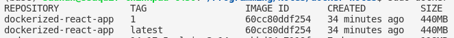

# Docker: Part 1

Docker Fundamentals & Running Simple Single Container Apps via Docker

## Other Note(s)

- [Part 2](https://github.com/SSaquif/docker-notes/blob/master/part-2.md): Running Multi Container Apps. Uses a full stack Mern App as example.
- [Part 3](https://github.com/SSaquif/docker-notes/blob/master/part-3.md): Covers Deployment

## Contents

<!-- toc -->

- [Docker: Part 1](#docker-part-1)
  - [Other Note(s)](#other-notes)
  - [Contents](#contents)
  - [Quick Commands](#quick-commands)
  - [Issues](#issues)
    - [Issue 1 (Solved)](#issue-1-solved)
      - [Replicating The Issue](#replicating-the-issue)
      - [My Fix for the Issue](#my-fix-for-the-issue)
  - [Issue 2: Unsolved](#issue-2-unsolved)
    - [Hacky Solution](#hacky-solution)
  - [Installation](#installation)
  - [Using Docker Without `sudo`](#using-docker-without-sudo)
  - [Introduction](#introduction)
    - [Why Docker?](#why-docker)
  - [Containers vs Virtual Machines](#containers-vs-virtual-machines)
  - [Docker Architecture](#docker-architecture)
  - [Dockerization of an App](#dockerization-of-an-app)
    - [Dockerfile Example](#dockerfile-example)
    - [Running The App using Docker](#running-the-app-using-docker)
  - [A Note for Windows Users](#a-note-for-windows-users)
  - [Containers vs Images](#containers-vs-images)
  - [Building Images & Running Containers](#building-images--running-containers)
    - [Build Context](#build-context)
    - [Registries](#registries)
    - [Selecting the Right Base Image](#selecting-the-right-base-image)
    - [Running Containers](#running-containers)
    - [Running Shell Sessions Inside Containers](#running-shell-sessions-inside-containers)
  - [Anatomy of a Dockerfile](#anatomy-of-a-dockerfile)
    - [FROM](#from)
    - [WORKDIR](#workdir)
    - [COPY](#copy)
    - [ADD](#add)
    - [Excluding Files `.dockerignore`](#excluding-files-dockerignore)
    - [RUN](#run)
    - [ENV](#env)
    - [EXPOSE](#expose)
    - [Managing Users (RUN & USER commands)](#managing-users-run--user-commands)
      - [Login In as a Particular User in Interactive Shell](#login-in-as-a-particular-user-in-interactive-shell)
      - [Creating System User and Primary Group](#creating-system-user-and-primary-group)
      - [Updating Dockerfile](#updating-dockerfile)
    - [CMD (setting the default command to run)](#cmd-setting-the-default-command-to-run)
      - [Difference between RUN & CMD](#difference-between-run--cmd)
    - [ENTRYPOINT](#entrypoint)
      - [ENTRYPOINT VS CMD](#entrypoint-vs-cmd)
  - [Speeding Up Builds](#speeding-up-builds)
  - [Removing Images and Containers](#removing-images-and-containers)
  - [Image Tags and their Importance](#image-tags-and-their-importance)
    - [Creating Tags during Build Phase](#creating-tags-during-build-phase)
    - [Remove Images by Tags](#remove-images-by-tags)
    - [Tagging Image After Building](#tagging-image-after-building)
    - [Fixing Outdated Tags](#fixing-outdated-tags)
  - [Sharing Images](#sharing-images)
  - [Saving and Loading Images](#saving-and-loading-images)
  - [Working with Containers and Volumes](#working-with-containers-and-volumes)
    - [Starting Containers](#starting-containers)
    - [Viewing Logs](#viewing-logs)
    - [Publishing Ports](#publishing-ports)
    - [Executing Commands on a Running Container `exec`](#executing-commands-on-a-running-container-exec)
      - [docker exec VS run](#docker-exec-vs-run)
    - [Stopping and Restarting Containers](#stopping-and-restarting-containers)
      - [docker start vs run](#docker-start-vs-run)
    - [Removing Containers](#removing-containers)
    - [Container File System](#container-file-system)
    - [Volumes](#volumes)
      - [Inspecting volumes](#inspecting-volumes)
      - [Persisting Data using volumes](#persisting-data-using-volumes)
      - [Testing Volume Data is Persistant](#testing-volume-data-is-persistant)
    - [Copying Files/Folders Between HOST & CONTAINERS](#copying-filesfolders-between-host--containers)
    - [`Important` Publishing Changes & Sharing Source Code with Containers](#important-publishing-changes--sharing-source-code-with-containers)
    - [Hacky Solution 2](#hacky-solution-2)
  - [Quick Cleanup Commands](#quick-cleanup-commands)
  - [References](#references)

<!-- tocstop -->

## Quick Commands

See section(s) below for details on most commands

```bash
# build switches
# -t means tag, a tag name for our image

# build/rebuild image named first-dockerized-app from current folder
docker build -t first-dockerized-app .

# run switches
# -i = interactive, brings up an interactive shell/cli when applicable
# for ex if we run just a node image, -i will bring up the node cli

# -t = means to allocate a pseudo-tty (pseudo terminal, see linux notes)
# or google pseudo-tty

# running an image/app = spinning off a container
# If we don't have the image locally
# It will try and automatically pull one with same id, if that exists
docker run image-id

# start container in interactive mode using -i
# -t switch might be unnecessary
# according to man docker run
# -t means to allocate a pseudo-tty (pseudo terminal, see linux notes)
# ubuntu is the image-id
# this will run an ubuntu image
# a new ubuntu shell will show up
dock run -it ubuntu

# Run Shell Sessions Inside Containers
# Super useful to test if everything
# is working as expected inside the container
docker run -it first-dockerized-app sh # alpine
docker run -it first-dockerized-app bash # ubuntu

# get help about image command
docker image

# list all docker images and details
docker image ls
# or
docker images

# run app from any directory using image name, after image creation
docker run image-name

# pulling image from dockerhub
docker pull image-id

# list of running processes/containers
docker ps
# list all containers
docker ps -a #(stopped ones too)
docker container ls

# inspect container logs
# avaialbale switches -t, -f, -n
# use docker logs --help for details
docker logs <container>


# docker remove container
# -f = force
# dont have to use full id,
# first couple of letters are fine as long as it is unique
docker container rm -f <container_id>
# remove multiple
docker container rm -f <container_id1> <container_id2>
# remove all stopped containers
docker container prune

# docker remove image
# -f = force
# won't work even with -f, if image is used by some container
docker image rm -f <image_id/name>
# remove multiple
docker image rm -f <image_id/name1> <image_id/name2> <image_id/name3>

# REMOVE ALL containers & images (combination of 2 commands)
docker container rm -f $(docker container ls -aq)
docker image rm -f $(docker image ls -aq)

# help regarding image and container commands
docker image help
docker container help

# copy files
docker cp <containerID>:/app/log.txt .   # container to host
docker cp secret.txt <containerID>:/app  # host to container
```

## Issues

### Issue 1 (Solved)

Before I continue I want to list out 1 issue. It could be the result of using ubuntu according to a stack overflow answer.

The issue is right now if I add `node_modules/` folder to the dockerignore file and then create and set a new user for my image in the dockerfile. The new user does not have the permission to make the `node_modules` folder and the process fails

Here are some stack overflow links I have read and found somwwaht useful.

My fix which you can see later is create the workdir and new user first and then change the owner of the workdir while still root user, And then finally set the user to be the newly created user

- [This one says it might be due to ubuntu but no solution given](https://stackoverflow.com/questions/67087735/eacces-permission-denied-mkdir-usr-app-node-modules-cache-how-can-i-creat)
- [This one has solution using npm and not yarn](https://stackoverflow.com/questions/55926705/docker-error-eacces-permission-denied-mkdir-project-node-modules-cache)
- [Open Issue on similar topic](https://github.com/nodejs/docker-node/issues/740)

#### Replicating The Issue

The state of my `Dockerfile` & `.dockerignore` files to replicate the error

```.dockerignore
node_modules/
```

```docker
FROM node:14.17.5-alpine3.14
RUN addgroup app && adduser -S -G app app
USER app
WORKDIR /app
COPY --chown=app:app . .
RUN yarn install
# the env var is unnecessary, just for testing
ENV API_URL=http://api.myapp.com/
# read notes to see how expose works
EXPOSE 3000
CMD ["yarn", "start"]
```

#### My Fix for the Issue

```docker
FROM node:14.17.5-alpine3.14
RUN addgroup app && adduser -S -G app app
# 2 lines added to fix permission issue
# when running yarn install
RUN mkdir /app
RUN chown -R app:app /app
# Set app as user AFTER setting permissions
USER app
WORKDIR /app
COPY --chown=app:app . .
RUN yarn install
# the env var is unnecessary, just for testing
ENV API_URL=http://api.myapp.com/
# read notes to see how expose works
EXPOSE 3000
CMD ["yarn", "start"]
```

## Issue 2: Unsolved

See section [`Important` Publishing Changes & Sharing Source Code with Containers](#important-publishing-changes--sharing-source-code-with-containers)

### Hacky Solution

Set `node` as the default user in dockerfile and give it correct permissions, that should work.

## Installation

Use google for instructions.

In addition, in order to run Multi container applications, we need `Docker Compose`. So [install that as well](https://docs.docker.com/compose/install/)

## Using Docker Without `sudo`

This way you don't have to type in sudo each time. [link](https://docs.docker.com/engine/install/linux-postinstall/)

## Introduction

### Why Docker?

Often things will run in one machine but not another, why?

1. Missing file(s)
2. Software/Dependency Version Mismatches

With `Docker` we can package up our entire Applications (with all the correct version for each dependency) and run it on any machine that has docker.

So with new jobs you don't have to spend a day setting up the environment.

We can use `docker` to set everything up as required and `docker` will create an isolated enviroment as required called a `container`

## Containers vs Virtual Machines

|                                                      Containers                                                      |                                    Virtual Machines                                    |
| :------------------------------------------------------------------------------------------------------------------: | :------------------------------------------------------------------------------------: |
|                                          An isolated env for running an app                                          |                    An abstraction of a machine (physical hardware)                     |
|                                                   Are lightweight                                                    |       Uses a type of Software called a Hypervisors used to create and manage VMS       |
|                                                                                                                      |                         Ex of Hypervisor: Virtual Box, VMware                          |
|                                                                                                                      |      The host machine can then use the hypervisor, to create VM(s) within itself       |
|                                                 Uses OS of the host                                                  |                             Each VM needs a full blown OS                              |
|                                                    Starts quickly                                                    |                                Therefore slow to start                                 |
| Less resource intensive and no allocation of hardware resources needed. A single host can run hundreds of containers | Resource intensive as hardware resources of the host have to be allocated between VMs. |

## Docker Architecture

// TODO
Write Notes for section using

1. Class slides
2. Mosh's video

Quick Summmary for now

1. Uses client server architecture
2. Use Rest API for client-server communication
3. Server is the docker engine
4. There's a docker desktop app for mac and windows but not linux yet.

## Dockerization of an App

We can add docker to any application by simply adding a `Dockerfile`, the name is capitalised

Docker uses this file to package up our app into an `image`

The image contains everything our app needs to run, ex

1. A cut-down OS
2. A runtime env (Node/Python etc)
3. Application files
4. 3rd party libraries
5. Environmental Variables

### Dockerfile Example

```dockerfile
FROM node:alpine
COPY . /app
WORKDIR /app
CMD node index.js
```

1. Line 1: `FROM node:alpine`

   - Typically we start with a base image (it can be OS, RE like node)
   - Base Image will have bunch of files and we will add to it
   - We started of with `node` image
   - We then optionally added the `linux distribution alphine`
   - `alpine` is a very small distribution so it will keep image size small

2. Line 2: `COPY . /app`

   - We want our image to have all our required files
   - The Dockerfile is at the root of our project, ie `.`
   - So we copy over everything and put in a `/app` folder for the image to use

3. Line 3: `WORKDIR /app`

   - This line is optional
   - This basically specifies where the image will find the files
   - ie the working directory for the image to use

4. Line 4: `CMD node index.js`
   - Finally this line tells docker how to run the app
   - If we omitted line 3, we would have to do `CMD node /app/index.js`

### Running The App using Docker

First We tell docker to build/package up our application.

Then we simply

```bash
# -t means tag, a tag name for our image
# In this case first-dockerized-app
# Then specify where to find dockerfile
# In this case the current directory so just `.`
docker build -t first-dockerized-app .

# run app from any directory using image name
docker run first-dockerized-app
```

## A Note for Windows Users

Windows 10+ ships with a Linux kernel. So when using Docker, you can choose between Windows or Linux containers. Windows containers (processes) need to talk to the Windows kernel under the hood. Linux containers need the Linux kernel.

These are essentially two different isolated worlds. You can choose between these two worlds by right-clicking on the Docker icon in the notification tray (in the bottom status bar).

Remember: the images and containers in the Windows world are invisible to the Linux world. You'd need Windows containers only if you need an image that starts from Windows.

## Containers vs Images

Just remember `multiple Containers` can be spinned up from the `same Image`. But the `Containers` are all `isolated`.

|                                         Images                                         |                                  Containers                                  |
| :------------------------------------------------------------------------------------: | :--------------------------------------------------------------------------: |
| A image contains all the files and configuration settings needed to run an application |   Once we have an image we can start one or multople container(s) from it    |
|                                     A cut down OS                                      |                 Is can of like in VM in the following sense                  |
|                                  3rd Party Libraries                                   |            1. Provides an isolated environment for executing apps            |
|                                   Application files                                    |                  2. Can be stoppeds and restarted like VMs                   |
|                                 Environment Variables                                  | Is just a sytem process, that has it's own file system provided by the image |
|                                                                                        | Each container is an `isolated instance`, can't access each others resources |
|                                                                                        |          There are ways to share data between containers if needed           |

## Building Images & Running Containers

We build images using `docker build -switches image-id .` command. The `.` is current folder and needs a dokcerfile in that folder.

### Build Context

When we execute a build command, the docker client sends the contect of the directory, in the above case `.`(current folder), to the docker engine. This is called the build context.

Then the docker engine will execute the instructions of the dockerfile in the folder 1 by 1. The docker engine will not have access to any files outside the directory.

### Registries

Images are kept in registries. The default registry is dockerhub. But some images, like microsoft images, are kept in other registries like the microsoft container registry. For those you need to use the complete URL. Example:

```docker
# mcr == microsoft container registry
FROM mcr.microsoft.com/dotnet/sdk:5.0 AS build-env
```

### Selecting the Right Base Image

The base image can be an OS or OS + Runtime Environment

If you are a js dev you likely want want to start with node image, for C# you want to start with .NET image, for python a pythom image and so on.

[Language specific samples](https://docs.docker.com/language/)

For our example we need a node image, there are many flavors of node image + some OS available to us. They are identified by there tags. Each tag has the OS and CPU architecture specified and also the size. We use alpine OS here due to it's much smaller image size compared to something like ubuntu.

[Node Images](https://hub.docker.com/_/node?tab=tags&page=1&ordering=last_updated)

By default the latest tag is used (see below). But we will never do this because let's say the latest node version is updated. Then the next time we build our app using docker, it will update the node version. Something we might not want

```docker
# both commands are identical
# don't do this
FROM node
FROM node:latest
```

### Running Containers

```bash
# Run Shell Sessions Inside Containers
docker run first-dockerized-app
docker run first-dockerized-app
```

### Running Shell Sessions Inside Containers

The above isn't as useful when testing containers. Often we want to Run Shell Sessions Inside Containers. To have a look around.

We can do this as follows

```bash
# Run Shell Sessions Inside Containers
# To understand the switches see the Quick Commands section
docker run -it first-dockerized-app sh # alpine
docker run -it first-dockerized-app bash # ubuntu
```

## Anatomy of a Dockerfile

But before we can build proper images, we need a dockerfile to build the image from. In this section we will break down the different parts of the dockerfile, by creating an image for the default boiler plate react app. So first we creat a react app as usual and add a dockerfile to it.

Following section looks into how to build docker images by going through each docker command. In the next `Building Images section` we will see an example for building an image of the boilerplate react app.

The section outlines

- Basic instructions like adding and removing files for docker
- running terminal commands on docker
- setting `env variables` in docker
- exposing ports

### FROM

Where to get the base image from> See Building Images sections for more details. Particularly `Registries` & `Selecting the Right Base Image` sections.

```docker
# using docker hub
FROM node:alpine
# using mcr (see registry section)
FROM mcr.microsoft.com/dotnet/sdk:5.0 AS build-env
```

### WORKDIR

Creates the working directory for the image

```docker
WORKDIR /app
```

### COPY

To copy files to the image. The structure is basically `COPY what where`

If the destination folder does not exist, the folder will be created

`.` signifies the `WORKDIR`

We can only copy from the directory the Dockerfile is in. We can not copy anything outside of it, ie no going up folder(s)

The `COPY` command has 2 forms, one is like regular command. The other form takes an array like this `COPY ["filename", "destination"]`

```dockerfile
# copy one file into WORKDIR /app
COPY package.json /app
# copy multiple files, but where copy needs to end with /
COPY package.json package-lock.json /app/
# copy using pattern
COPY package*.json /app/
# copy everything from current dir into WORKDIR
# absolute path
COPY . /app/
# relative path if we aldready set `WORKDIR /app`
COPY . .
# copy file(s) with space in name, have to use the the array form
COPY ["file 1.txt", "readme.md", "."]
```

### ADD

Same as `COPY`, but has `2 additional features.`

First, You can copy using a url if you have access to that file

```docker
ADD https://www.somewhere.com/data.json .
```

Second, If you add a zip file, it will be automatically unzipped

```docker
ADD somefile.zip .
```

### Excluding Files `.dockerignore`

We use `.dockerignore` to exlude files from the image. The file name is `case-sensitive`

Basically docker's `.gitignore`, whatever you don't want copied put it here. Example `node_modules`. As usual transferring image after copying nude_modules to a remote docker server is a waste. The image size will be huge.

### RUN

Can run any valid OS commands using this.

```docker
RUN ls -l
RUN npm install
```

### ENV

Used to set up environmental variables.

```docker
# new better way
ENV API_URL=http://www.somesite.com/

# old way, space instead of =
ENV API_URL http://www.somesite.com/
```

To double check that the `env var` was added to the container environment, we can run one of the following commands

```bash
# Step 1: Start interactive shell session
sudo docker run -it dockerized-react-app sh
# Step 2; Once inside new shell, check env var
printenv
# OR
echo $ENV_VAR_NAME
```

### EXPOSE

Used to Expose Ports

We will often have to expose ports. For example, Port 3000 is used to start a deployment server when we run `npm start`

Once we dockerize such apps, the app will run inside the docker container. This port `3000` will be open on the container and not on the host machine.

\*\*`Important:` On the same machine we can have multiple containers running the same image, all these containers will be listening to Port 3000. But the port 3000 of the host is not going to be automatically mapped to these containers.

Later we will see how to map a port on the host to a port on a container. But for now, we will use the `Expose` command to tell what port this container will be listening to

```docker
EXPOSE 3000
```

\*\*`Important:` `Expose` command does not automatically publish the port on the host. It's just `a form of documentation` to tell us this container will eventually listen to port 3000. So later when we properly run this app inside a docker container, we know that we should map a port on the host host to port 3000 on the container. Will do that in next section.

### Managing Users (RUN & USER commands)

Also see managings users in linux notes if needed. In order to first create user.

#### Login In as a Particular User in Interactive Shell

```bash
# the image used in the example was ubuntu
# interactively run bash in a pseudo shell
# login as the user john
docker exec -it -u john imageid bash
```

#### Creating System User and Primary Group

`Important:` I am having permission issues trying run `yarn install`. For Details see issue section above.

First let's see how this would be done from the alpine command line. Alpine only has `adduser` command no `useradd` (see linux notes if you need a refresher).

It common est practice in linux to keep the name of the user and their primary group same.

```sh
# Step 1: Create Group
addgroup app
# Step 2: Create User
# -S = Create a System User
# -G = Set User's Primary Group
# First name = group name
# Second name = user name
adduser -S -G sadnan sadnan

# Alternatively, doing it in 1 line
addgroup app && adduser -S -G sadnan sadnan

# check user's groups, if u want
groups sadnan
```

Now we will put this in a docker file using the `RUN` command. The set the user using 'USER' command. All follwing commands will be executed as the set user

```docker
RUN addgroup app && adduser -S -G app app
USER app
# All following commands will be executed as the user named 'app'
```

`Side Note:` After building the image it is a good idea to check if the user has been created as expected. Do this by starting a Shell Session and running the command `whoami` on the terminal. The newly created user will fall in the `others` group. Next if you run 'ls -la' you should also see that the newly created user only has read permissions. This is what we want. If we execute the app as root user, hackers could potentially rewrite everything.

#### Updating Dockerfile

`Important:` I will have to update this section, once I fix the aforementioned issue.

Now we should have the following dockerfile

```docker
FROM node:14.17.5-alpine3.14
WORKDIR /app
COPY . .
RUN yarn install
# the env var is unnecessary, just for testing
ENV API_URL=http://api.myapp.com/
# read notes to see how expose works
EXPOSE 3000
RUN addgroup app && adduser -S -G app app
USER app
```

Now after we have bnuilt our image, we can spin up an container and try and run the react app using `yarn start` from the container like this

```bash
docker run dockerized-react-app yarn start
```

`Important:` However that does not work. We get `EACCES: permission denied, mkdir '/app/node_modules/.cache'`. Because the current user `app` was created later and does not have the correct permissions.

If you run `ls -l` from within a interactive shell running in the container, we will see the `root` user is the actual owner of the files.

To fix this, we have to do 2 things

1. Create our group and user first.
2. Make a change to COPY instruction. See the links to see why (mosh doesnt do this)
   - [Stackoverflow link 1](https://stackoverflow.com/questions/55926705/docker-error-eacces-permission-denied-mkdir-project-node-modules-cache)
   - [Stackoverflow link 2](https://stackoverflow.com/questions/41097652/how-to-fix-ctrlc-inside-a-docker-container)

So we update the dockerfile as follows. `app` is the primary user and group

```docker
FROM node:14.17.5-alpine3.14
RUN addgroup app && adduser -S -G app app
# 2 lines added to fix permission issue
# when running yarn install
RUN mkdir /app
RUN chown -R app:app /app
# next create user and set dir
USER app
WORKDIR /app
# Give owner rights to the current user (probably unnecessary now)
COPY --chown=app:app . .
RUN yarn install
# the env var is unnecessary, just for testing
ENV API_URL=http://api.myapp.com/
# read notes to see how expose works
EXPOSE 3000
```

If you run `ls -l` now, you will see instead of `root` the owner is `app` for the files and folders

### CMD (setting the default command to run)

Next we want to set a default command to run when we run our container, instead of having to type it each time. We use `CMD`

The CMD instruction has 2 forms

1. Shell form
2. Execution form, which takes an array (use this)

The common practice is use the exec form, because the shell form will start another shell to run the commands so it starts an extra process.

We add one of these lines to the dockerfile

```docker
# Shell form
CMD yarn start
# Exec form
CMD ["yarn", "start"]
```

#### Difference between RUN & CMD

The `RUN` instruction is a build time instruction, executing when `building the image`. The `CMD` instruction is a run time instruction, executed when we `run the container`

[Differences between RUN and CMD](https://nickjanetakis.com/blog/docker-tip-7-the-difference-between-run-and-cmd)

It does not make sense to have multiple `CMD` instructions in the dockerfile. If you do, only the last one will take effect.

### ENTRYPOINT

A very simmilar command to `CMD`, also has 2 forms like `CMD`. Shell and Execution forms.

```docker
ENTRYPOINT ["yarn", "start"]
```

#### ENTRYPOINT VS CMD

We can easily override the CMD comand. For example we can start an interactive shell session instead of executing the CMD instructions. Like we have done previously and below. But it's little harder to overwrite entrypoint.

It's personal preference which command you want to use

```bash
# will overwrite CMD
docker run -it  dockerized-react-app sh
# will overwrite entrypoint
docker run -it  dockerized-react-app --entrypoint sh
```

## Speeding Up Builds

So images are basically made up of layers (see the video for furthur clarification). We can check out the size of the layers to help optimize. We can check the layers by running. Each Instruction is kind of like a layer.

```bash
# This will print out he layers
# Top = newest
docker history dockerized-react-app
```

When an instruction in the dockerfile has not changed, we don't necessarily have to create it from scratch, can use the cache (from layer I guess) instead.

Once a layer has been rebuilt all the following layers have to be rebuilt as well.

We don't necessarily want to run the npm install step if only code has changed and not dependencies. We can do this by copying the package.json and lock files separately.

Here's our new docker file

```docker
FROM node:14.17.5-alpine3.14
RUN addgroup app && adduser -S -G app app

# 2 lines added to fix permission issue
# when running yarn install
RUN mkdir /app
RUN chown -R app:app /app
# Set app as user AFTER setting permissions
USER app
WORKDIR /app
# Copy and install separtely to speed up builds
COPY --chown=app:app package*.json yarn.lock ./
RUN yarn install
# Give owner rights to the current user
COPY --chown=app:app . .
# the env var is unnecessary, just for testing
ENV API_URL=http://api.myapp.com/
# read notes to see how expose works
EXPOSE 3000
CMD ["yarn", "start"]
```

## Removing Images and Containers

```bash
# docker remove container
# -f = force
docker container rm -f <container_id>
# remove all stopped containers
docker container prune

# docker remove image
# -f = force
# won't work even with -f, if image is used by some container
docker image rm -f <image_id>
# remove all 'dangling' images
docker image prune
```

## Image Tags and their Importance

[See vid](https://codewithmosh.com/courses/the-ultimate-docker-course/lectures/31448369)

By default docker will associate the `latest` tag for each repository. This does not necessarily mean it's actually the latest version of image. If we don't update the tags properly, latest might be out of date.

For developemnt `latest` is fine but not in production or staging. So it's important to give our own tags.

### Creating Tags during Build Phase

```bash
# tagging an image while building it
# tag is 1, 3.1.5, buster (all are valid)
docker build -t react-app:1 .
docker build -t react-app:3.1.5 .
docker build -t react-app:buster .
```

After building with a tag we can see 2 images with same id but different tags



### Remove Images by Tags

This will remove the image with tag 1 altogether

```docker
docker image remove react-app:1
```

### Tagging Image After Building

Will create a new image from the altest tag, they will both share the same image id, just like before

```docker
docker image tag react-app:latest react-app:1
```

### Fixing Outdated Tags

If we change the code now and build a new image with new tag. This new image will have a new image id. This image is now the latest but the one with latest tag will still point to the older image as denoted by the id (ie it will still have the old id). To fix this we can do

```bash
# updating the latest tag, id will be updated
docker image tag react-app:2 react-app:latest
```

## Sharing Images

[See video as we have to upload to dockerhub](https://codewithmosh.com/courses/the-ultimate-docker-course/lectures/31448365)

## Saving and Loading Images

[See Vid](https://codewithmosh.com/courses/the-ultimate-docker-course/lectures/31448374)

## Working with Containers and Volumes

This section covers containers in more details. We cover

- Starting and Stopping containers
- Publishing Ports
- Viewing Logs
- Executing commands in containers
- Removing Containers
- Persisting data using Volumes
- Sharing Source Code with containers

### Starting Containers

See quick commands section or previous sections for running in interactive mode (an interactive shell).

```bash
docker run --help                # get help
docker run <image>
docker run -d <image>             # run in the background (detached mode)
docker run --name <name> <image>  # to give a custom name to container
```

### Viewing Logs

```bash
docker logs --help                # get help
docker logs <containerID>
docker logs -f <containerID>     # to follow the log
docker logs -t <containerID>     # to add timestamps
docker logs -n 10 <containerID>  # to view the last 10 lines
```

### Publishing Ports

Here we are publishing host's port 3000 to containers port 3000. Afterwords we can go to localhost:3000 as per usual and the app will show up (if it's something like a react/node app that is).

The port numbers can be different

```bash
docker run —p 3000:3000 <image>    # to publish a port HOST:CONTAINER
```

Afterwars if you run `docker ps` or `docker container`, we should see this change in the ports section of the relevant container

### Executing Commands on a Running Container `exec`

By default the command that runs is specified by `CMD` or `Entrypoint`. But what if we need to run some other command for troubleshooting. Fo example what if I wasnt to check the files

```bash
# see the contents of the working directory
docker exec <container_id/name> ls
# start an interactive shell session similar to run
docker exec -it <container_id/name> sh
```

#### docker exec VS run

With `run` we start a new container and run a command.

With `exec` we execute a command in a running container

Using exec commands we can run ANY commands in a running container. We can even start an interactive shell (see above) like with run, but if you close the shell the container is still running unlike with `RUN`

### Stopping and Restarting Containers

```bash
docker stop <container name/id>
docker start <container name/id>
```

#### docker start vs run

With docker run we start a `NEW` container

With docker start we start a `STOPPED` container

### Removing Containers

`Side Note:` You can not remove a running container unless you stop it first or use `-f`

```bash
docker container rm <container name/id> # more verbose
docker rm <container name/id>           # shortcut
docker rm -f <container name/id>        # removes running containers
docker container prune                  # remove all stoped container
# listing containers
docker ps -a                            # will list all running & stopped containers
# find a particular container by name or id
docker ps -a | grep <container name/id>
```

### Container File System

Each Container has its own file system that is invisible to other containers.

To test run 2 container from the same image and create a file in one container. Now access the other container (via an interactive shell for example), but the file won't be there

### Volumes

Volume is a storage outside of containers, Can be a directory on the host or somewhere on the clouds.

One of their main uses is to persist data among multiple containers (see section below).

```bash
# man page for docker volume
docker volume       # shortcut
docker volume help

# create volume
docker volume create <name>

# link volume to a container (see section below)
# Most time you do it in detached mode -d
docker run -v <volume-name>:/<path to folder> <image>

# list volume
docker volume ls

# inspect volume
docker volume inspect <name>

# remove volumes
docker volume prune   # remove all unused local volumes
docker volume rm <name1> <name 2>
```

#### Inspecting volumes

When inspecting volume (see how above), the driver property tells us where the volume is located. `local` means it's on the host. For creating volumes in cloud platforms you will probably have to read documentation

[Video](https://codewithmosh.com/courses/the-ultimate-docker-course/lectures/31448945)

#### Persisting Data using volumes

The correct way to persist data among multiple containers is uisng volumes

Previously we saw how to link volumes to containers. You need to do this for every container where you want to link the volume

```bash
# format
docker run -v <volume-name>:/<path in container> <image>

# practical example
docker run -v app_data:/app/data dockerized-react-app
```

1. If a volume with the same name (app_data) does not exist it will be created
2. The volume will be mapped to the `/app/data` folder in the above example
3. If the folder does not exist it will be created
4. This can cause permission issues, if the user is not root
5. So it's better to create the folder in the docker file

#### Testing Volume Data is Persistant

Once we have inititated a volume as explained in previous sections. We can test it's persistance as follows

1. Run a Container whose Image has a Volume associated with it
2. Create a new file and write something to it in the mapped volume directory of the container
3. Remove the container
4. Spin up a new container and see that stuff that was written still exists within the container

### Copying Files/Folders Between HOST & CONTAINERS

Often times we want to copy files from container to host or vice versa. Often done to check logs. Works for both files and folders according to doumentation.

```bash
# copy files
# container to host
docker cp <containerID>:<file path> <host directory>  # format
docker cp <containerID>:/app/log.txt .                # example
# host to container
docker cp <path in host> <containerID>:<file path>    # format
docker cp secret.txt <containerID>:/app               # example
```

### `Important` Publishing Changes & Sharing Source Code with Containers

> `Important:` This is labelled as Issue 2 on top This did not work as expected for me. When mapping host to container, the owner of the files of the mapped container becomes `node` instead of `app`. This creates access issues and the website breaks.
>
> I posted a [stack overflow question](https://stackoverflow.com/questions/68866419/docker-permission-issues-when-mapping-host-to-container-for-instant-updates-when)
>
> `Hacky Solution:` Set `node` as the default user in dockerfile and give it correct permissions, that should work. But I don't like that seems like a security risk
> `Hacky Solution 2:` [Idea from here](https://forum.codewithmosh.com/t/docker-section-5-working-with-containers-lesson-11-error-and-solution/6380), but will proably stop working if any files outside `/src` changes. Also see section below

We usually want to keep working and see those changes reflected in the containers right away while we are developing projects.

So how to publish changes we make to code to containers?

1. In Production

   - Always build a new IMAGE
   - Tag it properly & deploy
   - Then you spin off containers from it
   - More about this in the deploy section

2. In Development
   - Unlike in production, we want things done faster
   - In order to not consume so much time building again and gain
   - We can create a mapping between host and container
   - the syntax is very similar to mapping a volume from host to container

```bash
docker run -v <app path in host>:<Image Workdir> <image>
# can use pwd as a variable if pwd == app folder in
docker run -v $(pwd):/app <image>

# to test apps and mapping right away,
# good idea to map the container and host ports
# running in detached mode
docker run -d -p 5000:3000 -v $(pwd):/app <image>
```

Here are the commands I ran. The mapping cause permissions issues. So this does not work as expected.

```bash
# This works as expected
# create container with port mapping
# but I don't map host to container
docker run -d -p 5002:3000 --name not-mapped-container dockerized-react-app

# Does not work as expected
# Map host to container for instant updates
docker run -d -p 8080:3000 --name mapped-container -v $(pwd):/app  dockerized-react-app
# run interactive shell again
sudo docker exec -it <container_id/name> sh
# list the files again but now the owner is node
/app $ ls -l
total 556
-rw-rw-r--    1 node     node           664 Aug 20 15:45 Dockerfile
-rw-r--r--    1 node     node          3362 Aug 19 19:14 README.md
drwxrwxr-x 1047 node     node         36864 Aug 19 19:14 node_modules
-rw-rw-r--    1 node     node           824 Aug 19 19:14 package.json
drwxrwxr-x    2 node     node          4096 Aug 19 19:14 public
drwxrwxr-x    2 node     node          4096 Aug 19 19:14 src
-rw-rw-r--    1 node     node        510089 Aug 19 19:14 yarn.lock
```

### Hacky Solution 2

Changed the mapping as noted [here](https://forum.codewithmosh.com/t/docker-section-5-working-with-containers-lesson-11-error-and-solution/6380)

Works, but will probably not work if anything outside `/src` folder changes

```bash
docker run -d -p 4001:3000 --name mapped-container-2 -v $(pwd)/src:/app/src  dockerized-react-app
# interactive container shell
sudo docker exec -it <container> sh
/app $ ls -l
total 528
-rw-rw-r--    1 app      app            674 Aug 20 18:40 Dockerfile
-rw-r--r--    1 app      app           3362 Aug 19 19:14 README.md
drwxr-xr-x    1 app      app           4096 Aug 20 15:45 data
drwxr-xr-x    1 app      app           4096 Aug 20 18:55 node_modules
-rw-rw-r--    1 app      app            824 Aug 19 19:14 package.json
drwxrwxr-x    2 app      app           4096 Aug 19 19:14 public
drwxrwxr-x    2 node     node          4096 Aug 19 19:14 src
-rw-rw-r--    1 app      app         510089 Aug 19 19:14 yarn.lock
```

## Quick Cleanup Commands

```bash
# remove all containers & images (cobination of 2 commands)
# images can't be removed if a container from that image exists
# ls with switch -q just lists all container/image ids only
# switch -a will list hidden containers as well
# rm with -f will force remove running containers
# we pass that to docker image rm as and argument using $()
# $() is basically used when we want the result of the command inside
docker container rm -f $(docker container ls -aq)
docker image rm -f $(docker image ls -aq)

```

## References

1. [Mosh Hamedani's Docker Course](https://codewithmosh.com/courses/the-ultimate-docker-course/lectures/31448372)
2. Prof Shane McIntosh's COMP 437: Software Delivery Course Slides
3. [Language specific samples](https://docs.docker.com/language/)
